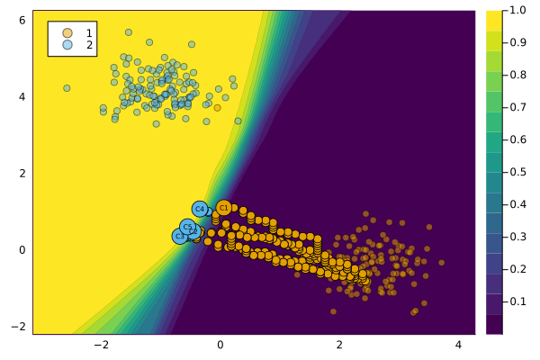

``` @meta
CurrentModule = CounterfactualExplanations 
```

# How to add Custom Generators

As we will see in this short tutorial, building custom counterfactual generators is straightforward. We hope that this will facilitate contributions through the community.

## Generic generator with dropout

To illustrate how custom generators can be implemented we will consider a simple example of a generator that extends the functionality of our `GenericGenerator`. We have noted elsewhere that the effectiveness of counterfactual explanations depends to some degree on the quality of the fitted model. Another, perhaps trivial, thing to note is that counterfactual explanations are not unique: there are potentially many valid counterfactual paths. One interesting (or silly) idea following these two observations might be to introduce some form of regularization in the counterfactual search. For example, we could use dropout to randomly switch features on and off in each iteration. Without dwelling further on the usefulness of this idea, let us see how it can be implemented.

The first code chunk below implements two important steps: 1) create an abstract subtype of the `AbstractGradientBasedGenerator` and 2) create a constructor similar to the `GenericConstructor`, but with one additional field for the probability of dropout.

``` julia
# Abstract suptype:
abstract type AbstractDropoutGenerator <: AbstractGradientBasedGenerator end

# Constructor:
struct DropoutGenerator <: AbstractDropoutGenerator
    loss::Union{Nothing,Symbol} # loss function
    complexity::Function # complexity function
    λ::AbstractFloat # strength of penalty
    decision_threshold::Union{Nothing,AbstractFloat} 
    opt::Any # optimizer
    τ::AbstractFloat # tolerance for convergence
    p_dropout::AbstractFloat # dropout rate
end

# Instantiate:
using LinearAlgebra
generator = DropoutGenerator(
    :logitbinarycrossentropy,
    norm,
    0.1,
    0.5,
    Flux.Optimise.Descent(0.025),
    0.1,
    0.5
)
```

Next, we define how feature perturbations are generated for our dropout generator: in particular, we extend the relevant function through a method that implemented the dropout logic.

``` julia
using CounterfactualExplanations.Generators
using StatsBase
function Generators.generate_perturbations(
    generator::AbstractDropoutGenerator, 
    ce::CounterfactualExplanation
)
    s′ = deepcopy(ce.s′)
    new_s′ = Generators.propose_state(generator, ce)
    Δs′ = new_s′ - s′ # gradient step

    # Dropout:
    set_to_zero = sample(
        1:length(Δs′),
        Int(round(generator.p_dropout*length(Δs′))),
        replace=false
    )
    Δs′[set_to_zero] .= 0
    return Δs′
end
```

Finally, we proceed to generate counterfactuals in the same way we always do:

``` julia
ce = generate_counterfactual(x, target, counterfactual_data, M, generator)
plot(ce)
```


