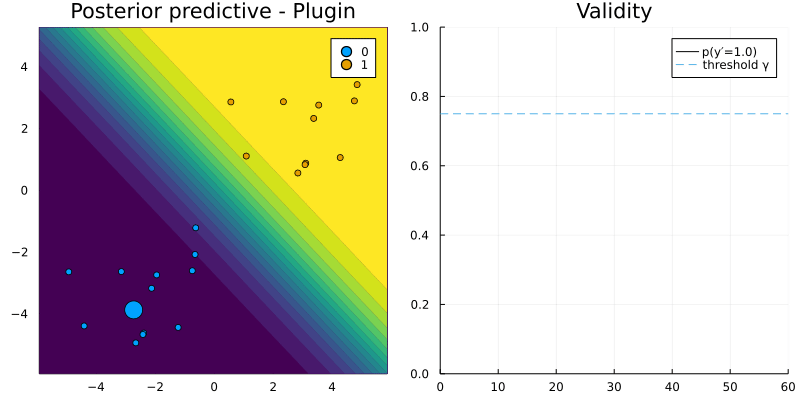

``` @meta
CurrentModule = CounterfactualExplanations 
```

# Binary classification

To understand the core functionality of `CounterfactualExplanations.jl` we will look at two example use cases of the `generate_counterfactual` function. This function takes a structure of type `AbstractGenerator` as its main argument. You can utilize one of the [default generators](#default-generators): `GenericGenerator <: AbstractGenerator`, `GreedyGenerator <: AbstractGenerator`. Alternatively, you can also create your own custom generators as we will see in own of the following sections.

## Default generators

### `GenericGenerator`

Let *t* ∈ {0, 1} denote the target label, *M* the model (classifier) and x′ ∈ ℝᴰ the vector of counterfactual features. In order to generate recourse the `GenericGenerator` optimizes the following objective function through steepest descent

``` math
x\prime = \arg \min_{x\prime}  \ell(M(x\prime),t) + \lambda h(x\prime)
```

where ℓ denotes some loss function targeting the deviation between the target label and the predicted label and *h*(⋅) is a complexity penalty generally addressing the *realism* or *cost* of the proposed counterfactual.

Let’s generate some toy data:

``` julia
# Some random data:
using CounterfactualExplanations.Data
Random.seed!(1234)
N = 25
w = [1.0 1.0]# true coefficients
b = 0
xs, ys = Data.toy_data_linear(N)
X = hcat(xs...)
counterfactual_data = CounterfactualData(X,ys')
plt = plot()
plt = plot_data!(plt,X',ys);
savefig(plt, joinpath(www_path, "binary_samples.png"))
```


For this toy data we will now generate counterfactual explanations as follows:

-   Use the coefficients `w` and `b` (assumed to be known or estimated) to define our model using `CounterfactualExplanations.Models.LogisticModel(w, b)`. (The first figure below shows the posterior predictive surface for this plugin estimator.)
-   Define our `GenericGenerator`.
-   Generate counterfactual.

``` julia
# Logit model:
using CounterfactualExplanations.Models: LogisticModel, probs 
M = LogisticModel(w, [b])
# Randomly selected factual:
Random.seed!(123)
x = select_factual(counterfactual_data,rand(1:size(X)[2]))
y = round(probs(M, x)[1])
target = ifelse(y==1.0,0.0,1.0) # opposite label as target

# Define generator:
generator = GenericGenerator()

# Generate explanations:
counterfactual = generate_counterfactual(x, target, counterfactual_data, M, generator)
```


The animation below shows the resulting counterfactual path in the feature space (left) and the predicted probability (right). We can observe that the sample crosses the decision boundary and reaches the threshold target class probability *γ*.



### `GreedyGenerator`

Next we will repeat the exercise above, but instead use the `GreedyGenerator` in the context of a Bayesian classifier. This generator is greedy in the sense that it simply chooses the most salient feature {x′}ᵈ where

``` math
d=\arg\max_{d \in [1,D]} \nabla_{x\prime} \ell(M(x\prime),t)
```

and perturbs it by a fixed amount *δ*. In other words, optimization is penalty-free. This is possible in the Bayesian context, because maximizing the predictive probability corresponds to minimizing the predictive uncertainty: by construction the generated counterfactual will therefore be *realistic* (low epistemic uncertainty) and *unambiguous* (low aleotoric uncertainty).

``` julia
using LinearAlgebra
Σ = Symmetric(reshape(randn(9),3,3).*0.01 + UniformScaling(1)) # MAP covariance matrix
μ = hcat(b, w)
M = CounterfactualExplanations.Models.BayesianLogisticModel(μ, Σ)
generator = GreedyGenerator(;δ=0.1,n=25))
counterfactual = generate_counterfactual(x, target, counterfactual_data, M, generator)
```

Once again we plot the resulting counterfactual path (left) and changes in the predicted probability (right). For the Bayesian classifier predicted probabilities fan out: uncertainty increases in regions with few samples. Note how the greedy approach selects the same most salient feature over and over again until its exhausted.


