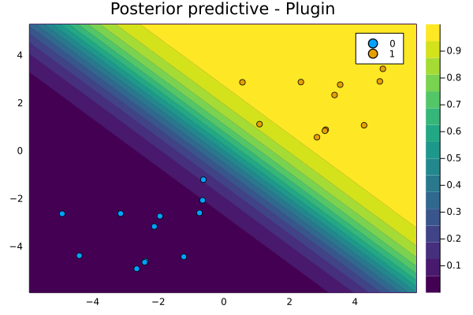
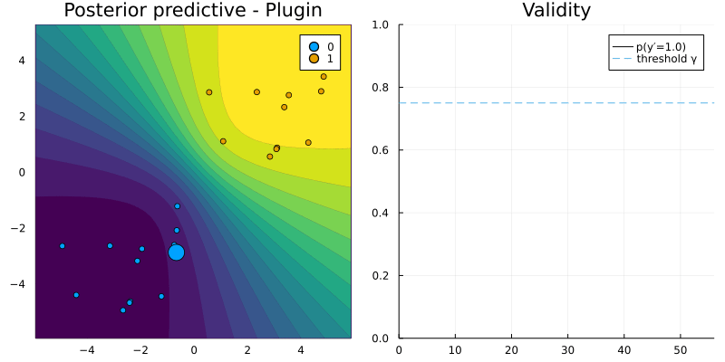

``` @meta
CurrentModule = CounterfactualExplanations 
```

# Counterfactual explanations for binary classification

To understand the core functionality of `CounterfactualExplanations.jl` we will look at two example use cases of the `generate_counterfactual` function. This function takes a structure of type `AbstractGenerator` as its main argument. Users can utilize one of the [default generators](#default-generators): `GenericGenerator <: AbstractGenerator`, `GreedyGenerator <: AbstractGenerator`. Alternatively, users can also create their own [custom generator](#custom-generators).

## Default generators

### `GenericGenerator`

Let *t* ∈ {0, 1} denote the target label, *M* the model (classifier) and x′ ∈ ℝᴰ the vector of counterfactual features. In order to generate recourse the `GenericGenerator` optimizes the following objective function through steepest descent

``` math
x\prime = \arg \min_{x\prime}  \ell(M(x\prime),t) + \lambda h(x\prime)
```

where ℓ denotes some loss function targeting the deviation between the target label and the predicted label and *h*(⋅) as a complexity penalty generally addressing the *realism* or *cost* of the proposed counterfactual.

Let’s generate some toy data:

``` julia
# Some random data:
using CounterfactualExplanations.Data
Random.seed!(1234);
N = 25
w = [1.0 1.0]# true coefficients
b = 0
xs, ys = Data.toy_data_linear(N)
X = hcat(xs...)
counterfactual_data = CounterfactualData(X,ys')
plt = plot()
plt = plot_data!(plt,X',ys);
savefig(plt, joinpath(www_path, "binary_samples.png"))
```


For this toy data we will now implement algorithmic recourse as follows:

-   Use the coefficients `w` and `b` to define our model using `CounterfactualExplanations.Models.LogisticModel(w, b)`.
-   Define our `GenericGenerator`.
-   Generate counterfactual.

``` julia
using CounterfactualExplanations.Models: LogisticModel, probs 
# Logit model:
M = LogisticModel(w, [b])
# Randomly selected factual:
Random.seed!(123);
x = select_factual(counterfactual_data,rand(1:size(X)[2]))
y = round(probs(M, x)[1])
target = ifelse(y==1.0,0.0,1.0) # opposite label as target
```

``` julia
plt = plot_contour(X',ys,M;title="Posterior predictive - Plugin")
savefig(plt, joinpath(www_path, "binary_contour.png"))
```



``` julia
# Define generator:
generator = GenericGenerator()
# Generate recourse:
counterfactual = generate_counterfactual(x, target, counterfactual_data, M, generator)
```

Now let’s plot the resulting counterfactual path in the 2-D feature space (left) and the predicted probability (right):

``` julia
import CounterfactualExplanations.Counterfactuals: target_probs
T = total_steps(counterfactual)
X_path = reduce(hcat,path(counterfactual))
ŷ = target_probs(counterfactual,X_path)
p1 = plot_contour(X',ys,M;colorbar=false, title="Posterior predictive - Plugin")
anim = @animate for t in 1:T
    scatter!(p1, [path(counterfactual)[t][1]], [path(counterfactual)[t][2]], ms=5, color=Int(y), label="")
    p2 = plot(1:t, ŷ[1:t], xlim=(0,T), ylim=(0, 1), label="p(y′=" * string(target) * ")", title="Validity", lc=:black)
    Plots.abline!(p2,0,counterfactual.params[:γ],label="threshold γ", ls=:dash) # decision boundary
    plot(p1,p2,size=(800,400))
end
gif(anim, joinpath(www_path, "binary_generic_recourse.gif"), fps=25)
```


### `GreedyGenerator`

Next we will repeat the exercise above, but instead use the `GreedyGenerator` in the context of a Bayesian classifier. This generator is greedy in the sense that it simply chooses the most salient feature {x′}ᵈ where

``` math
d=\arg\max_{d \in [1,D]} \nabla_{x\prime} \ell(M(x\prime),t)
```

and perturbs it by a fixed amount *δ*. In other words, optimization is penalty-free. This is possible in the Bayesian context, because maximizing the predictive probability *γ* corresponds to minimizing the predictive uncertainty: by construction the generated counterfactual will therefore be *realistic* (low epistemic uncertainty) and *unambiguous* (low aleotoric uncertainty).

``` julia
using LinearAlgebra
Σ = Symmetric(reshape(randn(9),3,3).*0.01 + UniformScaling(1)) # MAP covariance matrix
μ = hcat(b, w)
M = CounterfactualExplanations.Models.BayesianLogisticModel(μ, Σ);
generator = GreedyGenerator(Dict(:δ=>0.1,:n=>25))
counterfactual = generate_counterfactual(x, target, counterfactual_data, M, generator)
```

Once again we plot the resulting counterfactual path (left) and changes in the predicted probability (right). For the Bayesian classifier predicted probabilities splash out: uncertainty increases in regions with few samples. Note how the greedy approach selects the same most salient feature over and over again until its exhausted (i.e. it has been chosen `GreedyGenerator.n` times).

``` julia
import CounterfactualExplanations.Counterfactuals: target_probs
T = total_steps(counterfactual)
X_path = reduce(hcat,path(counterfactual))
ŷ = target_probs(counterfactual,X_path)
p1 = plot_contour(X',ys,M;colorbar=false, title="Posterior predictive - Plugin")
anim = @animate for t in 1:T
    scatter!(p1, [path(counterfactual)[t][1]], [path(counterfactual)[t][2]], ms=5, color=Int(y), label="")
    p2 = plot(1:t, ŷ[1:t], xlim=(0,T), ylim=(0, 1), label="p(y′=" * string(target) * ")", title="Validity", lc=:black)
    Plots.abline!(p2,0,counterfactual.params[:γ],label="threshold γ", ls=:dash) # decision boundary
    plot(p1,p2,size=(800,400))
end
gif(anim, joinpath(www_path, "binary_greedy_recourse.gif"), fps=25);
```


