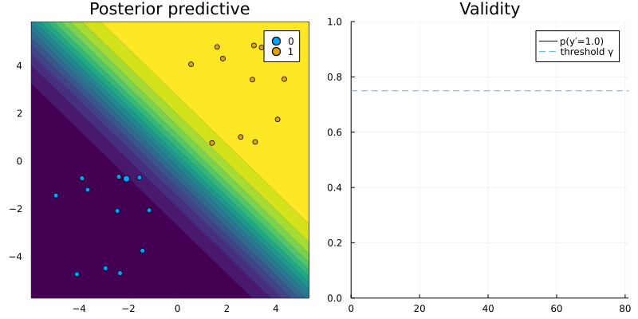

``` @meta
CurrentModule = CounterfactualExplanations 
```

# Custom generators

As we will see in this short tutorial, building custom counterfactual generators is straight-forward. We hope that this will facilitate contributions through the community.

## Generic generator with dropout

To illustrate how custom generators can be implemented we will consider a simple example of a generator that extends the functionality of our `GenericGenerator`. We have noted elsewhere that the effectiveness of ounterfactual explanations depends to some degree on the quality of the fitted model. Another, perhaps trivial, thing to note is that counterfactual explanations are not unique: there are potentially many valid counterfactual paths. One interesting (or silly) idea following these two observations might be to introduce some form of regularization in the counterfactual search. For example, we could use dropout to randomly switch features on and off in each iteration. Without dwelling further on the usefulness of this idea, let us see how it can be implemented.

The first code chunk below implements two important steps: 1) create an abstract subtype of the `AbstractGradientBasedGenerator` and 2) create a constructor similar to the `GenericConstructor`, but with one additional field for the probability of dropout.

``` julia
# Abstract suptype:
abstract type AbstractDropoutGenerator <: AbstractGradientBasedGenerator end

# Constructor:
struct DropoutGenerator <: AbstractDropoutGenerator
    loss::Symbol # loss function
    complexity::Function # complexity function
    mutability::Union{Nothing,Vector{Symbol}} # mutibility constraints 
    λ::AbstractFloat # strength of penalty
    ϵ::AbstractFloat # step size
    τ::AbstractFloat # tolerance for convergence
    p_dropout::AbstractFloat # dropout rate
end

# Instantiate:
using LinearAlgebra
generator = DropoutGenerator(
    :logitbinarycrossentropy,
    norm,
    nothing,
    0.1,
    0.1,
    1e-5,
    0.5
)
```

Next, we define how feature perturbations are generated for our dropout generator: in particular, we extend the relevant function through a method that implemented the dropout logic.

``` julia
import CounterfactualExplanations.Generators: generate_perturbations, ∇
using StatsBase
function generate_perturbations(generator::AbstractDropoutGenerator, counterfactual_state::CounterfactualState)
    𝐠ₜ = ∇(generator, counterfactual_state) # gradient
    # Dropout:
    set_to_zero = sample(1:length(𝐠ₜ),Int(round(generator.p_dropout*length(𝐠ₜ))),replace=false)
    𝐠ₜ[set_to_zero] .= 0
    Δx′ = - (generator.ϵ .* 𝐠ₜ) # gradient step
    return Δx′
end
```

Finally, we proceed to generate counterfactuals in the same way we always do. The code below simply generates some toy data, randomly selects a sample and runs the counterfactual search. The resulting counterfactual path is shown in [Figure 1](#fig-dropout).

``` julia
# Data:
using CounterfactualExplanations.Data
Random.seed!(1234)
N = 25
w = [1.0 1.0]# true coefficients
b = 0
xs, ys = Data.toy_data_linear(N)
X = hcat(xs...)
counterfactual_data = CounterfactualData(X,ys')

# Model:
using CounterfactualExplanations.Models: LogisticModel, probs 
# Logit model:
M = LogisticModel(w, [b])
# Randomly selected factual:
Random.seed!(123)
x = select_factual(counterfactual_data,rand(1:size(X)[2]))
y = round(probs(M, x)[1])
target = ifelse(y==1.0,0.0,1.0) # opposite label as target

# Generate recourse:
counterfactual = generate_counterfactual(x, target, counterfactual_data, M, generator)
```


