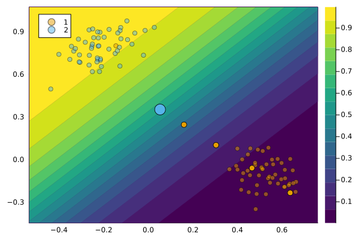
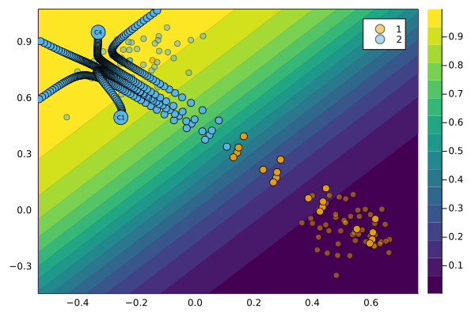

``` @meta
CurrentModule = CounterfactualExplanations 
```

# Handling Generators

Generating Counterfactual Explanations can be seen as a generative modelling task because it involves generating samples in the input space: $x \sim \mathcal{X}$. In this tutorial, we will introduce how Counterfactual `Generator`s are used. They are discussed in more detail in the explanatory section of the documentation.

## Off-the-Shelf Generators

Currently, the following off-the-shelf counterfactual generators are implemented in the package.

``` julia
generator_catalogue
```

    Dict{Symbol, DataType} with 6 entries:
      :gravitational => GravitationalGenerator
      :revise        => REVISEGenerator
      :dice          => DiCEGenerator
      :generic       => GenericGenerator
      :greedy        => GreedyGenerator
      :claproar      => ClaPROARGenerator

These `Generator`s are just composite types that contain information about how counterfactuals ought to be generated. To specify the type of generator you want to use, you can simply instantiate it:

``` julia
# Search:
generator = GenericGenerator()
ce = generate_counterfactual(x, target, counterfactual_data, M, generator)
plot(ce)
```



## Composable Generators

!!! warning "Breaking Changes Expected"
    Work on this feature is still in its very early stages and breaking changes should be expected.

One of the key objectives for this package is **Composability**. It turns out that many of the various counterfactual generators that have been proposed in the literature, essentially do the same thing: they optimize an objective function. Formally we have,

$$
\begin{aligned}
\mathbf{s}^\prime &= \arg \min_{\mathbf{s}^\prime \in \mathcal{S}} \left\{  {\text{yloss}(M(f(\mathbf{s}^\prime)),y^*)}+ \lambda {\text{cost}(f(\mathbf{s}^\prime)) }  \right\} 
\end{aligned} 
 \qquad(1)$$

where $\text{yloss}$ denotes the main loss function and $\text{cost}$ is a penalty term (Altmeyer et al. 2023).

Without going into further detail here, the important thing to mention is that [Equation 1](#eq-general) very closely describes how counterfactual search is actually implemented in the package. In other words, all off-the-shelf generators currently implemented work with that same objective. They just vary in the way that penalties are defined, for example. This gives rise to an interesting idea:

> Why not compose generators that combine ideas from different off-the-shelf generators?

The [`Generator`](@ref) class provides a straightforward way to do this, without requiring users to build custom `Generator`s from scratch. It can be instantiated as follows:

``` julia
generator = Generator()
```

By default, this creates a `generator` that simply performs gradient descent without any penalties. To modify the behaviour of the `generator`, you can define the counterfactual search objective function using the [`@objective`](@ref) macro:

``` julia
@objective(generator, logitbinarycrossentropy + 0.1distance_l2 + 1.0ddp_diversity)
```

Here we have essentially created a version of the [`DiCEGenerator`](@ref):

``` julia
ce = generate_counterfactual(x, target, counterfactual_data, M, generator; num_counterfactuals=5)
plot(ce)
```



## References

Altmeyer, Patrick, Giovan Angela, Aleksander Buszydlik, Karol Dobiczek, Arie van Deursen, and Cynthia Liem. 2023. “Endogenous Macrodynamics in Algorithmic Recourse.” In *First IEEE Conference on Secure and Trustworthy Machine Learning*.
