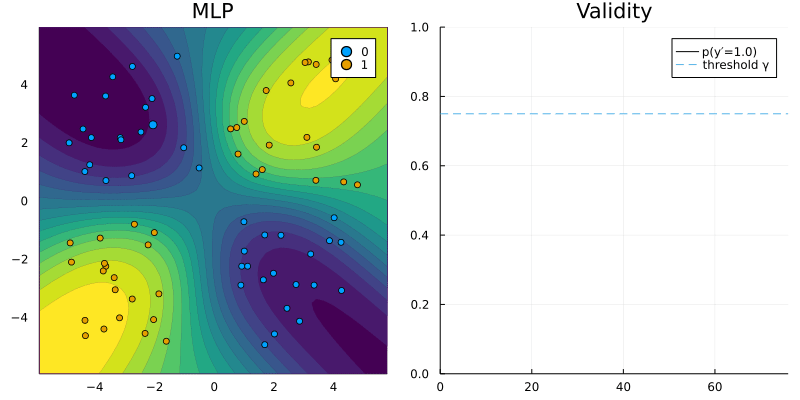
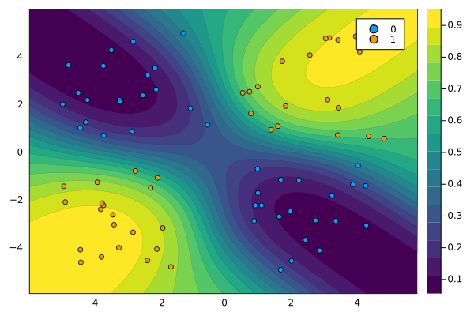

``` @meta
CurrentModule = CounterfactualExplanations 
```

# Models

## Default models

There are currently constructors for two default models, which mainly serve illustrative purposes ([Figure 1](#fig-models) below). Both take sets of estimated parameters at the point of instantiation: the constructors will not fit a model for you, but assume that you have already estimated the respective model yourself and have access to its parameter estimates. Based on the supplied parameters methods to predict logits and probabilities are already implemented and used in the counterfactual search.

``` julia
using GraphRecipes
p = plot(CounterfactualExplanations.Models.AbstractFittedModel, method=:tree, fontsize=8, nodeshape=:rect, axis_buffer=0.4, nodecolor=:white)
savefig(p, joinpath(www_path,"models.png"))
```


For the simple logistic regression model logits are computed as *a* = *X**w* + *b* and probabilities are simply *σ*(*a*). For the Bayesian logistic regression model logits are computed as *X**μ* and the predictive posterior is computed through Laplace approximation.

## Custom models

Apart from the default models you can use any arbitrary (differentiable) model and generate recourse in the same way as before. Only two steps are necessary to make your own model compatible with CounterfactualExplanations.jl:

1.  The model needs to be declared as a subtype of `CounterfactualExplanations.Models.AbstractFittedModel`.
2.  You need to extend the functions `CounterfactualExplanations.Models.logits` and `CounterfactualExplanations.Models.probs` to accept your custom model.

Below we will go through a simple example to see how this can be done in practice.

### Neural network

In this example we will build a simple artificial neural network using [Flux.jl](https://fluxml.ai/) for a binary classification task. First we generate some toy data below. The code that generates this data was borrowed from a great tutorial about Bayesian neural networks provided by [Turing.jl](https://turing.ml/dev/), which you may find [here](https://turing.ml/dev/tutorials/03-bayesian-neural-network/).

The plot below shows the generated samples in the 2D feature space where colours indicate the associated labels. CounterfactualExplanationsly this data is not linearly separable and the default `LogisticModel` would be ill suited for this classification task.

``` julia
# Number of points to generate.
N = 80
M = round(Int, N / 4)
Random.seed!(1234)

using CounterfactualExplanations.Data
xs, ys = Data.toy_data_non_linear(N)
X = hcat(xs...)
```


#### Training the model

Instead we will build a simple artificial neural network `nn` with one hidden layer. For additional resources on how to do deep learning with [Flux.jl](https://fluxml.ai/) just have a look at their documentation.

``` julia
nn = build_model(dropout=true,activation=Flux.σ)
loss(x, y) = Flux.Losses.logitbinarycrossentropy(nn(x), y)
ps = Flux.params(nn)
data = zip(xs,ys);
```

The code below trains the neural network for the task at hand. The plot shows the (training) loss over time. Note that normally we would be interested in loss with respect to a validation data set. But since we are primarily interested in generated recourse for a trained classifier, here we will just keep things very simple.

``` julia
using Flux.Optimise: update!, ADAM
opt = ADAM()
epochs = 100
avg_loss(data) = mean(map(d -> loss(d[1],d[2]), data))
show_every = epochs/10

for epoch = 1:epochs
  for d in data
    gs = gradient(params(nn)) do
      l = loss(d...)
    end
    update!(opt, params(nn), gs)
  end
  if epoch % show_every == 0
    println("Epoch " * string(epoch))
    @show avg_loss(data)
  end
end
```

#### Generating counterfactuals

Now it’s game time: we have a fitted model *M* : 𝒳 ↦ 𝒴 and are interested in generating recourse for some individual *x* ∈ 𝒳. As mentioned above we need to do a bit more work to prepare the model to be used by CounterfactualExplanations.jl.

The code below takes care of all of that: in step 1) it declares our model as a subtype of `Models.AbstractFittedModel` and in step 2) it just extends the two functions.

``` julia
using CounterfactualExplanations, CounterfactualExplanations.Models
import CounterfactualExplanations.Models: logits, probs # import functions in order to extend

# Step 1)
struct NeuralNetwork <: Models.AbstractFittedModel
    nn::Any
end

# Step 2)
logits(M::NeuralNetwork, X::AbstractArray) = M.nn(X)
probs(M::NeuralNetwork, X::AbstractArray)= σ.(logits(M, X))
M = NeuralNetwork(nn)
```

The plot below shows the predicted probabilities in the feature domain. Evidently our simple neural network is doing very well on the training data, as expected.


To preprocess the data we simply run the following:

``` julia
counterfactual_data = CounterfactualData(X,ys')
```

Now we just select a random sample from our data and based on its current label we set as our target the opposite label and desired threshold for the predicted probability.

``` julia
using Random
Random.seed!(123)
x = select_factual(counterfactual_data, rand(1:size(X)[2])) 
y = round(probs(M, x)[1])
target = ifelse(y==1.0,0.0,1.0) # opposite label as target
```

Then finally we use the `GenericGenerator` to generate counterfactual. The plot further below shows the resulting counterfactual path.

``` julia
# Define generator:
generator = GenericGenerator()
# Generate recourse:
counterfactual = generate_counterfactual(x, target, counterfactual_data, M, generator)
```



### Ensemble of neural networks

In the context of Bayesian classifiers the `GreedyGenerator` can be used since minimizing the predictive uncertainty acts as a proxy for *realism* and *unambiquity*. In other words, if we have a model that incorporates uncertainty, we can generate realistic counterfactuals without the need for a complexity penalty.

One efficient way to produce uncertainty estimates in the context of deep learning is to simply use an ensemble of artificial neural networks (also referred to as *deep ensemble*). To this end we can use the `build_model` function from above repeatedly to compose an ensemble of *K* neural networks:

``` julia
ensemble = build_ensemble(5;kw=(dropout=true,activation=Flux.σ))
```

Training this ensemble boils down to training each neural network separately:

``` julia
ensemble, anim = forward(ensemble, data, opt, n_epochs=epochs, plot_every=show_every); # fit the ensemble
gif(anim, joinpath(www_path, "models_ensemble_loss.gif"), fps=10)
```


Once again it is straight-forward to make the model compatible with the package. Note that for an ensemble model the predicted logits and probabilities are just averages over predictions produced by all *K* models.

``` julia
# Step 1)
struct FittedEnsemble <: Models.AbstractFittedModel
    ensemble::AbstractArray
end

# Step 2)
logits(M::FittedEnsemble, X::AbstractArray) = mean(Flux.flatten(Flux.stack([nn(X) for nn in M.ensemble],1)),dims=1)
probs(M::FittedEnsemble, X::AbstractArray) = mean(Flux.flatten(Flux.stack([σ.(nn(X)) for nn in M.ensemble],1)),dims=1)

M=FittedEnsemble(ensemble)
```

Again we plot the predicted probabilities in the feature domain. As expected the ensemble is more *conservative* because it incorporates uncertainty: the predicted probabilities splash out more than before, especially in regions that are not populated by samples.



Finally, we use the `GreedyGenerator` for the counterfactual search. For the same desired threshold *γ* as before, the counterfactual ends up somewhat closer to a cluster of original samples. In other words we end up providing more realisitic albeit likely more costly counterfactual.

``` julia
generator = GreedyGenerator(Dict(:δ=>0.1,:n=>30))
counterfactual = generate_counterfactual(x, target, counterfactual_data, M, generator)
```


