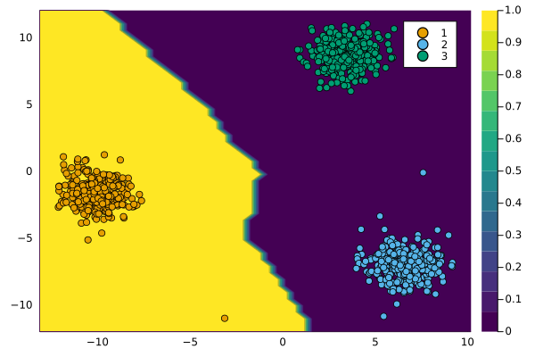

``` @meta
CurrentModule = CounterfactualExplanations 
```

# Counterfactuals for multi-class targets

In the existing literature counterfactual explanations have typically been applied in the binary classification setting (Verma, Dickerson, and Hines 2020). Research on algorithmic recourse in particular typically involves real-world datasets with an obvious target class - e.g. individual receives credit - and an adverse outcome - e.g. individual is denied loan (Karimi et al. 2020). Still, counterfactual explanations are very much also applicable in the multi-class setting. In this tutorial we will go through an illustrative example involving the toy dataset shown in [Figure 1](#fig-multi) below.

``` julia
using CounterfactualExplanations.Data
using MLJ
p = 5
n = 1000
X, ys = make_blobs(n, p, centers=3, as_table=false)
X = X'
using MLUtils
xs = unstack(X,dims=2)
y_train = Flux.onehotbatch(ys, sort(unique(ys)))
y_train = Flux.unstack(y_train',1)
counterfactual_data = CounterfactualData(X,ys')
```


## Classifier

To classify the data we use a simple multi-layer perceptron (MLP). In this case the MLP outputs four logits, one for each class. Contrary to the binary setting we therefore choose `logitcrossentropy` as our loss functiona as opposed to `logitbinarycrossentropy`.

``` julia
n_hidden = 32
out_dim = length(unique(ys))
kw = (output_dim=out_dim,input_dim=size(X,1))
nn = build_model(;kw...)
loss(x, y) = Flux.Losses.logitcrossentropy(nn(x), y)
ps = Flux.params(nn)
data = zip(xs,y_train)
```

The following code just trains the neural network for the task:

``` julia
using Flux.Optimise: update!, Adam
opt = Adam()
epochs = 100
avg_loss(data) = mean(map(d -> loss(d[1],d[2]), data))
show_every = epochs/10

for epoch = 1:epochs
  for d in data
    gs = gradient(Flux.params(nn)) do
      l = loss(d...)
    end
    update!(opt, Flux.params(nn), gs)
  end
  if epoch % show_every == 0
    println("Epoch " * string(epoch))
    @show avg_loss(data)
  end
end
```

To make the model compatible with our package we need to 1) declare it as a subtype of `Models.AbstractFittedModel` and 2) dispatch the relevant methods. Logits are returned by the model on call and passed through the softmax function to generate the vector of class probabilities.

``` julia
M = FluxModel(nn, likelihood=:classification_multi)
```

[Figure 2](#fig-multi-contour) shows the resulting class probabilities in the two-dimensional feature domain.


# Generating counterfactuals

We randomly select an individual sample from any class and choose any of the remaining classes as our target at random.

``` julia
# Randomly selected factual:
# Random.seed!(123)
x = select_factual(counterfactual_data, rand(1:size(X)[2])) 
y = Flux.onecold(probs(M, x),unique(ys))
target = rand(unique(ys)[1:end .!= y]) # opposite label as target
```

Generic counterfactual search can then be implemented as follows. The only difference to the binary setting is that we need to declare `logitcrossentropy` as the loss function for the counterfactual search. [Figure 3](#fig-multi-generic) shows the resulting counterfactual path.

``` julia
# Define generator:
generator = GenericGenerator()
# Generate recourse:
counterfactual = generate_counterfactual(x, target, counterfactual_data, M, generator, num_counterfactuals=1, γ=0.95)
```


## Deep ensemble

Staying consistent with previous tutorial we will also briefly look at the Bayesian setting. To incorporate uncertainty we use a simple deep ensemble instead of a single MLP.

``` julia
ensemble = build_ensemble(5;kw=kw)
ensemble, = forward(ensemble, data, opt, n_epochs=epochs, plot_loss=false)
```

As before, we need to subtype and disptach:

``` julia
import CounterfactualExplanations.Models: logits, probs
# Step 1)
struct FittedEnsemble <: Models.AbstractDifferentiableModel
    ensemble::AbstractArray
end

# Step 2)
using Statistics
logits(M::FittedEnsemble, X::AbstractArray) = selectdim(mean(Flux.stack([nn(X) for nn in M.ensemble],3), dims=3),3,1)
probs(M::FittedEnsemble, X::AbstractArray) = selectdim(mean(Flux.stack([softmax(nn(X)) for nn in M.ensemble],3),dims=3),3,1)

M=FittedEnsemble(ensemble)
```

[Figure 4](#fig-multi-ensemble-contour) shows the resulting class probabilities.



For the greedy recourse generator we also specify `logitcrossentropy` as our loss function and modify the hyperparameters slightly. [Figure 5](#fig-greedy) shows the resulting counterfactual path.

``` julia
generator = GreedyGenerator(loss=:logitcrossentropy,δ=0.25,n=30)
counterfactual = generate_counterfactual(x, target, counterfactual_data, M, generator)
```


# References

Karimi, Amir-Hossein, Gilles Barthe, Bernhard Schölkopf, and Isabel Valera. 2020. “A Survey of Algorithmic Recourse: Definitions, Formulations, Solutions, and Prospects.” *arXiv Preprint arXiv:2010.04050*.

Verma, Sahil, John Dickerson, and Keegan Hines. 2020. “Counterfactual Explanations for Machine Learning: A Review.” *arXiv Preprint arXiv:2010.10596*.
