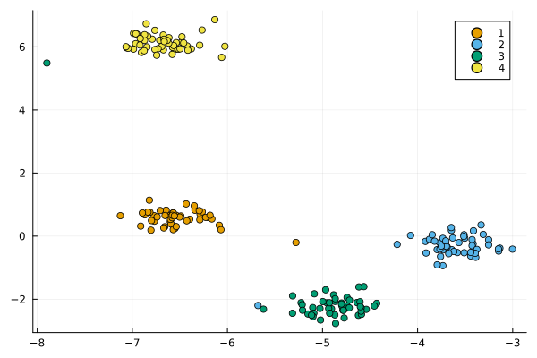
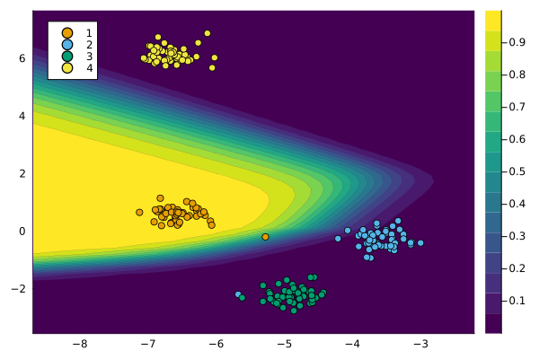

``` @meta
CurrentModule = CounterfactualExplanations 
```

# Recourse for multi-class targets

``` julia
using CounterfactualExplanations.Data
xs, ys = Data.toy_data_multi()
X = hcat(xs...)
y_train = Flux.onehotbatch(ys, unique(ys))
y_train = Flux.unstack(y_train',1)
plt = plot()
plt = plot_data!(plt,X',ys)
savefig(plt, joinpath(www_path, "multi_samples.png"))
```



## Classifier

``` julia
n_hidden = 32
out_dim = length(unique(ys))
kw = (output_dim=out_dim, dropout=true)
nn = build_model(;kw...)
loss(x, y) = Flux.Losses.logitcrossentropy(nn(x), y)
ps = Flux.params(nn)
data = zip(xs,y_train)
```

``` julia
using Flux.Optimise: update!, ADAM
opt = ADAM()
epochs = 10
avg_loss(data) = mean(map(d -> loss(d[1],d[2]), data))
show_every = epochs/10

for epoch = 1:epochs
  for d in data
    gs = gradient(params(nn)) do
      l = loss(d...)
    end
    update!(opt, params(nn), gs)
  end
  if epoch % show_every == 0
    println("Epoch " * string(epoch))
    @show avg_loss(data)
  end
end
```

``` julia
using CounterfactualExplanations, CounterfactualExplanations.Models
import CounterfactualExplanations.Models: logits, probs # import functions in order to extend

# Step 1)
struct NeuralNetwork <: Models.AbstractFittedModel
    nn::Any
end

# Step 2)
logits(M::NeuralNetwork, X::AbstractArray) = M.nn(X)
probs(M::NeuralNetwork, X::AbstractArray)= softmax(logits(M, X))
M = NeuralNetwork(nn);
```



``` julia
counterfactual_data = CounterfactualData(X,ys')
```

``` julia
# Randomly selected factual:
Random.seed!(42)
x = select_factual(counterfactual_data, rand(1:size(X)[2])) 
y = Flux.onecold(probs(M, x),unique(ys))
target = rand(unique(ys)[1:end .!= y]) # opposite label as target
```

``` julia
# Define generator:
generator = GenericGenerator(;loss=:logitcrossentropy)
# Generate recourse:
counterfactual = generate_counterfactual(x, target, counterfactual_data, M, generator)
```


## Deep ensemble

``` julia
ensemble = build_ensemble(5;kw=(output_dim=out_dim,))
ensemble, = forward(ensemble, data, opt, n_epochs=epochs, plot_loss=false)
```

``` julia
# Step 1)
struct FittedEnsemble <: Models.AbstractFittedModel
    ensemble::AbstractArray
end

# Step 2)
using Statistics
logits(M::FittedEnsemble, X::AbstractArray) = mean(Flux.stack([nn(X) for nn in M.ensemble],3), dims=3)
probs(M::FittedEnsemble, X::AbstractArray) = mean(Flux.stack([softmax(nn(X)) for nn in M.ensemble],3),dims=3)

M=FittedEnsemble(ensemble);
```


``` julia
generator = GreedyGenerator(loss=:logitcrossentropy,δ=0.25,n=20)
counterfactual = generate_counterfactual(generator, x, M, target, γ); # generate recourse
```


