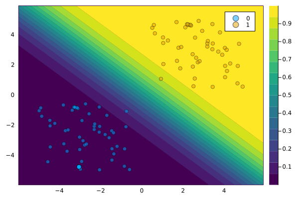

``` @meta
CurrentModule = CounterfactualExplanations 
```

# Mutability and domain constraints

In practice, features usually cannot be perturbed arbitrarily. Suppose, for example, that one of the features used by a bank to predict the credit worthiness of its clients is *gender*. If a counterfactual explanation for the prediction model indicates that female clients should change their gender to improve their credit worthiness, then this is an interesting insight (it reveals gender bias), but it is not usually an actionable transformation in practice. In such cases we may want to constrain the mutability of features to ensure actionable and realistic recourse. To illustrate how this can be implemented in `CounterfactualExplanations.jl` we will look at the linearly separable toy dataset again.

``` julia
# Data:
using CounterfactualExplanations.Data
xs, ys = Data.toy_data_linear()
X = hcat(xs...)

# Model
w = [1.0 1.0]# true coefficients
b = 0
# Logit model:
M = LogisticModel(w, [b])
```

## Mutability

Mutability of features can be defined in terms of four different options: 1) the feature is mutable in both directions, 2) the feature can only increase (e.g. age), 3) the feature can only decrease (e.g. time left until your next deadline) and 4) the feature is not mutable (e.g. skin colour, ethnicity, …). To specify which category a feature belongs to, you can pass a vector of symbols containing the mutability constraints at the pre-processing stage. For each feature you can choose from these four options: `:both` (mutable in both directions), `:increase` (only up), `:decrease` (only down) and `:none` (immutable). By default, `nothing` is passed to that keyword argument and it is assumed that all features are mutable in both directions.

Below we impose that the second feature is immutable. The resulting counterfactual path is shown in [Figure 1](#fig-mutability) below. Since only the first feature can be perturbed, the sample can only move along the horizontal axis.

``` julia
counterfactual_data = CounterfactualData(X,ys';mutability=[:both, :none])
```


## Domain constraints

In some cases we may also want to constrain the domain of some feature. For example, age as a feature is constrained to a range from 0 to some upper bound corresponding perhaps to the average life expectancy of humans. Below, for example, we impose an upper bound of 0.5 for our two features. This results in the counterfactual path shown in [Figure 2](#fig-mutability-domain): since features are not allowed to be perturbed beyond the upper bound, the resulting counterfactual falls just short of the threshold probability *γ*.

``` julia
counterfactual_data = CounterfactualData(X,ys';domain=(-Inf,0.5))
```



If we only want to constrain one particular feature to a certain domain we can pass a vector of tuples as below. In this case the resulting counterfactual path shown in [Figure 3](#fig-mutability-domain-2) does converge to the desired threshold *γ*.

``` julia
counterfactual_data = CounterfactualData(X,ys';domain=[(-Inf,Inf),(-Inf,-0.5)])
```


