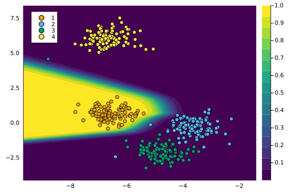

# Whistle-Stop Tour

``` @meta
CurrentModule = CounterfactualExplanations 
```

In this tutorial, we will go through a slightly more complex example involving synthetic data. We will generate Counterfactual Explanations using different generators and visualize the results.

## Data and Classifier

``` julia
# Choose some values for data and a model:
n_dim = 2
n_classes = 4
n_samples = 400
model_name = :MLP
```

The code chunk below generates synthetic data and uses it to fit a classifier. The outcome variable `counterfactual_data.y` consists of 4 classes. The input data `counterfactual_data.X` consists of 2 features. We generate a total of 400 samples. On the model side, we have specified `model_name = :MLP`. The `fit_model` can be used to fit a number of default models.

``` julia
counterfactual_data = load_multi_class(n_samples)
counterfactual_data.standardize = true
M = fit_model(counterfactual_data, model_name)
```

The chart below visualizes our data along with the model predictions. In particular, the contour indicates the predicted probabilities generated by our classifier. By default, these are the predicted probabilities for $y=1$, the first label. For multi-dimensional input data is compressed into two dimensions and the decision boundary is approximated using Nearest Neighbors (this is still somewhat experimental).

``` julia
plot(M, counterfactual_data)
```



## Counterfactual Explanation

Next, we begin by specifying our target and factual label. We then draw a random sample from the non-target (factual) class.

``` julia
# Factual and target:
target = 2
factual = 4
chosen = rand(findall(predict_label(M, counterfactual_data) .== factual))
x = select_factual(counterfactual_data,chosen)
```

This sets the baseline for our counterfactual search: we plan to perturb the factual `x` to change the predicted label from `y`=4 to our target label `target`=2.

Counterfactual generators accept several default parameters that can be used to adjust the counterfactual search at a high level: for example, a `Flux.jl` optimizer can be supplied to define how exactly gradient steps are performed. Importantly, one can also define the threshold probability at which the counterfactual search will converge. This relates to the probability predicted by the underlying black-box model, that the counterfactual belongs to the target class. A higher decision threshold typically prolongs the counterfactual search.

``` julia
# Search params:
decision_threshold = 0.75
num_counterfactuals = 3
```

The code below runs the counterfactual search for each generator available in the `generator_catalogue`. In each case, we also call the generic `plot()` method on the generated instance of type `CounterfactualExplanation`. This generates a simple plot that visualizes the entire counterfactual path. The chart below shows the results for all counterfactual generators.

``` julia
ces = Dict()
plts = []
# Search:
for (key, Generator) in generator_catalogue
    generator = Generator()
    ce = generate_counterfactual(
        x, target, counterfactual_data, M, generator;
        num_counterfactuals = num_counterfactuals,
        decision_threshold=decision_threshold,
        converge_when=:generator_conditions
    )
    ces[key] = ce
    plts = [plts..., plot(ce; title=key, colorbar=false)]
end
```


